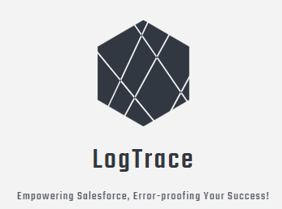

# Problem Statement in Legacy Error Logging 


- In trigger context, if we are performing rollback using throw statement from catch block, we won't be able to store the error logs in salesforce, since all the DML will be rolled back.
```java
  try {
    insert new Account();
  } catch (Exception ee) {
    logException(ee);
    throw ee; // error logging DML will also be rolledback 
  }

```
- Database.rollback does not work for trigger context sobject.
- It was impossible to see from the “Apex Job Log” if batch jobs are successful or not, since all caught exceptions are reported as “success”.
- An additional DML operation is needed in the same transaction.

## What are the possible options?

To resolve the problem stated above, we needed an option to insert the error logging in a separate transaction.
- ***Future:*** Future jobs queued by a transaction aren’t processed if the transaction rolls back. Hence, if a transaction rollback, future method will not be invoked. 


## Error Logging Using Platform Event
- ***Platform Event:*** Platform Events work on an event bus-driven architecture and provide an asynchronous thread model. Since a platform event trigger runs in a separate transaction from the one that fired it, governor limits are reset, and the event trigger gets its own set of limits. We are setting the publish behaviour of a platform event to "Publish Immediately" so that the event message will get published regardless of whether the synchronous transaction succeeds.

### Workflow for Error Logging using Platform Events
Error Occurs: When an error occurs in the application code, a catch block or exception handler captures the error details.

- Error Data Preparation: The error data, including the error message, stack trace, component name, user information, timestamp, and any additional context information, is formatted into a log event payload.

- Platform Event Creation: Depending on the type of error (Batch Apex, Flow Execution, or custom error), the appropriate platform event is created.

- Publish Platform Event: The platform event is published to the Platform Event Bus, ensuring it is asynchronously captured for further processing.

- Event Triggers and Subscribers: Event triggers and subscriber classes are set up to listen for the error events. They process and store the error data in custom objects, logs, or external systems for monitoring and analysis.
### Benefits of Error Logging using Platform Events
- **Asynchronous Logging:** Error logging using platform events occurs asynchronously, reducing the performance impact on the main application logic.

- **Real-time Monitoring:** Error events are processed in real-time, enabling immediate detection of issues and providing insights into application health.

- **Centralized Error Data:** All error events are stored in the same platform event object, creating a centralized repository for error logs.

- **Scalability:** Platform Events can handle high volumes of error data, allowing for scalable error logging.

- **Customizable Error Data:** Custom platform events allow for flexible error data structures to meet specific logging and analysis requirements.

- **Governor Limits Isolation:** Platform event triggers run in separate transactions, ensuring governor limits are isolated from the main application transactions.

## Types of Platform Event we are using in this logging framework:
**BatchApexErrorEvent:** This platform event is used to log errors that occur during the execution of Batch Apex jobs. It allows capturing errors related to batch processing and helps in monitoring and debugging batch jobs.To fire a platform event, a batch Apex class declaration must implement the Database.RaisesPlatformEvents interface. Otherwise BatchApexErrorEvent will not be fired on getting an exception. This event can capture LIMIT exception as well . Published Internally by Salesforce when batch exception occurred.


**FlowExecutionErrorEvent:**  Notifies subscribers of errors related to screen flow executions. Messages for this platform event aren’t published for autolaunched flows or processes. This object is available in API version 47.0 and later. . This event can capture LIMIT exception as well. Published Internally by Salesforce when flow exception occurred. The subscription for FlowExecutionErrorEvent using Apex Trigger was only supported until v48.0. After v48.0, the subscription for FlowExecutionErrorEvent was supported only by Flow and Processes.

**Custom Platform Events:** Custom platform events can be designed and used for logging specific errors or custom application events. This PE type can be used to log error from Apex Triggers, Controllers, Screen Flow with fault screen.  

# Is There Any Event Delivery Limitation?
Non-CometD clients, including Apex triggers, processes, and flows, don’t count against the event delivery limit. The number of event messages that an Apex trigger, process, or flow can process depends on how long the processing takes for each subscriber. The longer the processing time, the longer it takes for the subscriber to reach the tip of the event stream.

# Invoke LogTrace from Apex using below code snippet
``` java
try
{
  //error generated  
}catch(QueryException qe)
{
  GenericErrorLoggerClass.logException(qe, 'AccountTrigger');
}catch(DMLException de)
{
  GenericErrorLoggerClass.logException(de, 'AccountTrigger');
}catch(Exception ee)
{
  GenericErrorLoggerClass.logException(ee, 'AccountTrigger');
}
```
# Invoke LogTrace from Batch Apex by implementing the DataBase.RaisePlatformEvent on a Batch 
``` java
public with sharing class SamplePlatformEventBatch implements Database.Batchable<SObject>,Database.RaisesPlatformEvents
```
In order to enable error logging for batch class we just need to implement the DataBase.RaisePlatformEvent and LogTrace will take care of the rest


Reference: [Platform Event Limitation](https://developer.salesforce.com/docs/atlas.en-us.platform_events.meta/platform_events/platform_event_limits.htm)

